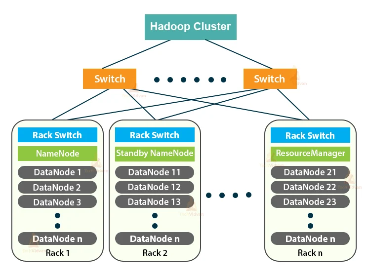

# Big Data
### What is Big Data ? 
Data that has high :
* Volume : Overall amt of data produced is huge
* Variety : Diff types of data sources and types, Social, CRM sys, 
* Velocity : How fast dat ais transferred 
* Veracity : Truthfullnes of the data available
* Value : How valueble the data is, on based on diff factors

### Sectors Big Data is Used
#### 1. Banking
- Preaproved loans and credit cards
- Credit score, Investments and other financial data
#### 2. Healthcare
- Images: Xray,MRI, CT Scan are used
- Personalised diagnosis, food recomendations, etc
#### 3. Enery
- EV hybrid data: Uses data for forecasting ev data
#### 4. Technology
- Ads: Data is used for personalising and forcasting product adverts
- How a person uses tech and their usage
#### 5. Consumer
- Forecasting customer demands
- Managing logistics and warehousing
#### 6. Manufacturing
- How product manufacturing is evolving according to the customer demand and supply.

### Why Big Data?
#### Challeges of traditional decision making
- Takes longer time for desicion making 
- Requires human interactions in between, had regular failures.
- Lacking of systamatic linkage of : Strategy, Planning, Execution and Reporting
- Didnt provide a larger scope of data view, Not able utilize the total data
- All these obstructed making a fully informed 
### Solution : Big Data Analytics
- Its is based on turn based decision making
- Provides a comprehensive view of results and analysis of data from various sources
- Streamlined decision making from top to bottom
- Can also analyze unstructured data
- Faster and efficient decision making improves the competivene advantage.
### Types of Data
- Unstructured : Data w/o any structure and stored freely. 

    Eg: PDF, images, videos, text
- Quasi-structured : Textual data with erratic formats that can be formated with diff tools

    Eg: Clickstream data
- Semi-structured : Textual data with apparent pattern, enabling analysis

    Eg: XML, CSV, JSON
- Structured : Data with defined data model, format, and structure

    Eg: Database, Excel (Spreadsheet)

## Big Data Pipeline
1. Data Source : Includes text data, web data, api, web logs (clickstream)
- mySQL, sql server, Postgress
2. Data Ingesion layer : Import and export data from source.
- SQOOP
- HDFS
- Flume 
- Kafka
3. Data collection layer : Temp storage, most data from Kafka
4. Data Storage Layer : S3, HDFS, Gluster FS. 
>   - Azure storages : blob, cosmos, db, azure darelake
5. Data Processing : Batch processing, Realtime processing
>   1. Batch processing: Performs process on humongous amount of data collected over time.
>   2. Realtime/Stream processing: Performs process on data on realtime. Collects data on an interval and process on it. Eg: Process data collected on an interval of 5 sec from a IoT and outputs every 5 seconds.
6. Data Query Layer : Spark SQL, Hive Redshift, etc
7. Analytic Engine : (Spark Framework) Statistical analysis, text analysis, predictive modeling, semantic analysis
8. Data Vitualization Layer : Output Data 
- Dashboard
- Tableau
9. Data Security Layer : Ensuring security of all Layer and Processes
10. Data Monitoring Layer : For admins to check the total activities

## Big Data Features
### 1. Scalability 
- Able to accomodate rapid changes in  growth of data, traffic and volume
- Utilises hardware and softwre to increase throughput/output and storage.
### 2. Fault Tolerance
- In Big data or Hadoop(HDFS) refers to woirking strength of a system in unfavourable conditions and the system handles it.
- HDFS also creates rerplicas of data and store in diff locations to avoid loss in data, in case of an error.
### 3. Handle Inconsistancy in Data
- It occures from many sources like knowldge, meta-knowledge, info, data.
- Big data storage should have features to handle these inconsistencies.
## Distributed Systems
- A Model in whch components located at networked computers communicate and coordinate actions by oassing messages to and fro.

## What is Hadoop?
- Hadoop is a framework that allows distributed processing of large databases across clusters of commodity computers using simple programming models.

## HADOOP
- HDFS : Storage
- MAPREDUCE : Processing
- YARN : Program methadology
### Charecteristics of HADOOP
1. Scalable : Can grow to our needs 
2. Flexible : Can be used in cheap systems
3. Economical : Not very demanding in system side
4. Reliable/Highly Available : Since data is copied and stored in many machines , the data is dafe and always available.

## RDBMS vs Hadoop

| Feature                       | RDBMS                                 | Hadoop                               |
|-------------------------------|---------------------------------------|--------------------------------------|
| **Data Model**                | Structured (tables with rows and columns) | Multi and Unstructured (files, key-value pairs) |
| **Data Storage**              | Structured data stored in tables       | Unstructured or semi-structured data stored in HDFS (Hadoop Distributed File System) |
| **Schema**                    | Fixed schema with predefined structure | Flexible schema; schema can evolve over time |
| **Scalability**               | Vertical scaling (scaling up by adding resources to a single server) | Horizontal scaling (scaling out by adding more nodes to the cluster) |
| **Data Processing**           | SQL queries for processing             | MapReduce, Spark, and other distributed processing frameworks |
| **Transaction Support**       |Read Many Write Many(Diff people can read and write at same time) | Read Many Write Once(Many can read at a time but only one can write at a time) |
| **Consistency Model**         | Strong consistency                     | Eventually consistent                 |
| **Performance**               | Optimized for transactional queries    | Optimized for batch processing and large-scale data analysis |
| **Use Cases**                 | OLTP (Online Transaction Processing), structured data applications | Big Data analytics, large-scale data processing, ETL (Extract, Transform, Load) |
| **Indexing**                  | Supports indexing for quick query access | Limited native indexing; relies on external tools |
| **Fault Tolerance**           | High availability through replication | High fault tolerance with data replication across nodes |
| **Data Integrity**            | Ensured through constraints and relationships | Integrity ensured at the application level; data may be duplicated |
| **Query Language**            | SQL (Structured Query Language)        | No standard query language; often uses SQL-like languages or APIs |
| **Cost**                      | Often involves licensing fees for commercial RDBMS solutions | Generally open-source; costs are related to infrastructure and maintenance |

## Hadoop Config
a) Modes of Config
- **Standalone mode**: All services run on a single JVM  in a machine
- **Pseodo distributed mode** : Each hadoop runs on its own in single JVM and machine
- **Fully distributed mode** : Each Hadoop runs on independent single JVM each and reside diff machines.

## Hadoop Cluster

## HDFS Architecture
- HDFS is a key compomet of the Hadoop ecosystem, designed to store and manage large volumes of data.
- Its designed to handle high throughput access of data and provde fault tolerance and high scalability.

### Key Components
- **NameNode** : Acts as master server thst manages metadata of the file system. Its file system info (Path to file)
- **DataNode** : 
### Notes: Replication

- All data blocks will be replicated into 3 bloacks:
- It follows 3 comnditions:
1. It always looks for another rack if available.
2. It Resources will be equally utilized by DataNodes and distributed equally and looks for closest to NameNode.
3. Replication will never hapen in same DataNode

### Notes: DataNode Failure
- If a DataNode goes down, the NameNode detects the failure and checks for other replicas of the same data block.
- It continues tasks using these replicas and initiates replication of the lost data block to other healthy DataNodes to maintain the desired replication level( 3 replicas ).
- Also the block which is down is automatically deleted.

### Concept of Multiple NameNodes
1. **Active NameNode**
2. **Secondary NameNode**
3. **Standby NameNode**

- An active NameNode contains:
    
    1) **Edit logs** : Marks down the changes as logs
    2) **FsImage** : Final cluster snapshot, it is copied and stored to the secondary NameNode for backup at regular intervals.

- **Zookeeper**:  This manages the automatic maintaince of the cluster. Gives instructions to the secondary or standby NameNodes to become Active incase of NameNode failure.
    - Zookeeper(Leader): Acts as active zookeeper
    - Zookeeper (Follower) : Backup in case of zookeper failure
- **Checkpointing** :  The primary function of Secondary NameNode is checkpointing, it involves periodical merging of NameNode edit log (changes) with Current file system (FsImage)  
    - Once the Edit Logs become large enough, secondary Namenode hepls it to convert it into a FsImage.
    - But if the Edit logs are really huge, it may cause a restart during the convertion, and during the time the cluster will be down.
    - Secondary helps in reducing the recovery time of the cluster due to checkpointing, the down time of the cluster minimizes 

- In older version of HDFS, there used to be frequent failures due to FsImage and Edit logs being stored in the ram, and ther used to be ram over loading
- This was resolved in version of hadoop 2 after introducing the secondary NameNode conmcept.
- Zookeper acts as a cordinator that monitors and instructs the active NameNode for the healthy working of the cluster. It monitors the overall working of the convertions of the NameNodes.
- **HDFS has default block size of 128MB**
  
  